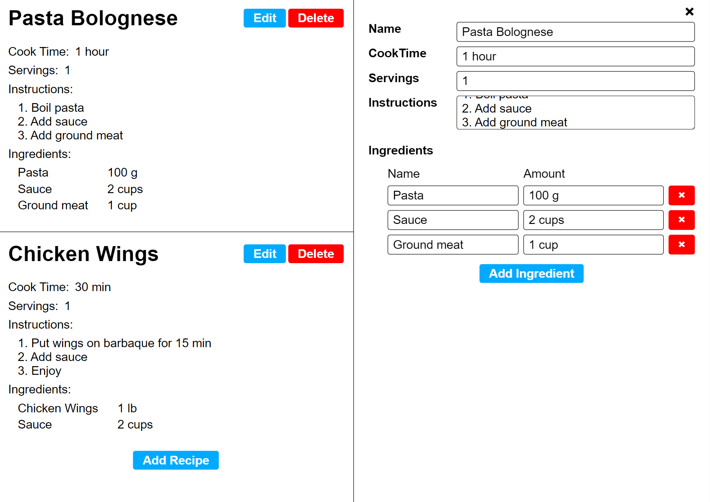

# Cooking With React

This is a README file for my WebDev Portfolio, completed by Joey Cosentino

## Important Links

* main repository link: https://github.com/JoeCosentino/react-practice
* Deployed URL: https://joecosentino.github.io/test-wd-portfolio/

## Description

* This project was completed as part of a course on react, created by Web Dev Simplified. This project utilizes all of the main components and features of React to create a dynamic and intuitive recipe cook book application

## To Download

* you can download these files to your local computer using either:
    1. SSH: git@github.com:JoeCosentino/react-practice.git
    2. HTTPS: https://github.com/JoeCosentino/react-practice.git

## Collaboraters

* Giuseppe (Joe) Cosentino
    - main developer on project
* Web Dev Simplified
    - This project was done through the completion of an online course created by Web Dev Simplified
* W3Schools
    - assisted in explaining certain relevant topics and features
* 

## Screenshot of Assignment

## Licensing

MIT License

Copyright (c) 2022 JoeCosentino

Permission is hereby granted, free of charge, to any person obtaining a copy
of this software and associated documentation files (the "Software"), to deal
in the Software without restriction, including without limitation the rights
to use, copy, modify, merge, publish, distribute, sublicense, and/or sell
copies of the Software, and to permit persons to whom the Software is
furnished to do so, subject to the following conditions:

The above copyright notice and this permission notice shall be included in all
copies or substantial portions of the Software.

THE SOFTWARE IS PROVIDED "AS IS", WITHOUT WARRANTY OF ANY KIND, EXPRESS OR
IMPLIED, INCLUDING BUT NOT LIMITED TO THE WARRANTIES OF MERCHANTABILITY,
FITNESS FOR A PARTICULAR PURPOSE AND NONINFRINGEMENT. IN NO EVENT SHALL THE
AUTHORS OR COPYRIGHT HOLDERS BE LIABLE FOR ANY CLAIM, DAMAGES OR OTHER
LIABILITY, WHETHER IN AN ACTION OF CONTRACT, TORT OR OTHERWISE, ARISING FROM,
OUT OF OR IN CONNECTION WITH THE SOFTWARE OR THE USE OR OTHER DEALINGS IN THE
SOFTWARE.